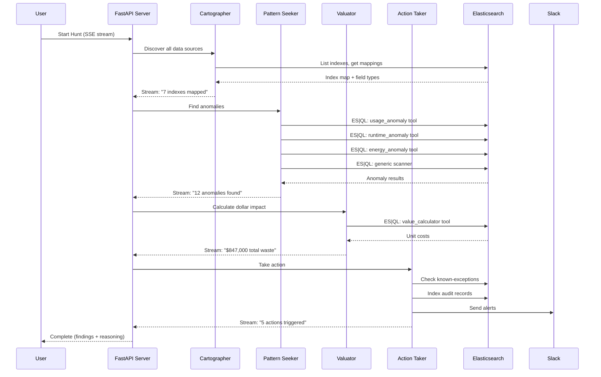
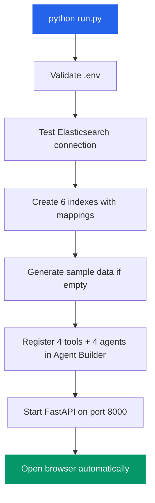
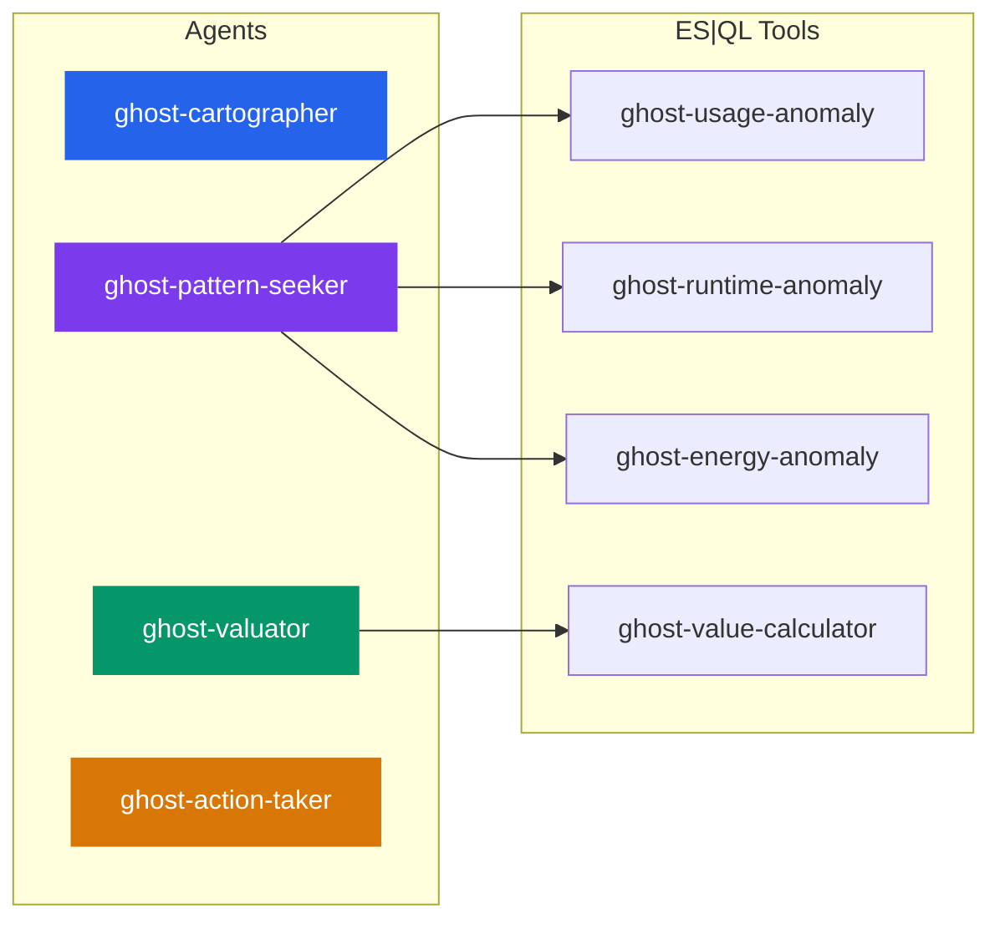

<p align="center">
  
  
  
  
  
</p>

<h1 align="center">Ghost Economy Hunter</h1>

<p align="center">
  <strong>Multi-agent AI system that finds hidden financial waste in <em>any</em> organization's data.</strong><br>
  Upload a CSV, connect a database, or bring your own data — 4 AI agents scan, analyze, value, and act on waste patterns automatically.
</p>

<p align="center">
  <em>Built for the Elastic Agent Builder Hackathon</em>
</p>

---

## The Problem

Every organization leaks money in ways nobody sees:

- **Hospitals** over-order drugs that expire unused
- **Factories** run machines overnight with nobody watching
- **Buildings** blast AC/heat into empty floors
- **Retailers** hold dead stock while re-ordering the same SKUs
- **Schools** pay for software licenses nobody uses

These are **ghost economies** — hidden costs buried in operational data that no single analyst can find manually. A typical manual audit takes **40+ hours**, covers 1-2 departments, and misses 85% of waste patterns.

## The Solution

```bash
python run.py
```

**One command. Four AI agents. Any data source. Millions in waste found.**

Ghost Economy Hunter is a multi-agent AI system that:

1. **Ingests any data** — CSV uploads, existing databases, IoT feeds, ERP exports
2. **Auto-discovers waste patterns** — using specialized + generic anomaly detection
3. **Calculates exact dollar impact** — with real pricing data, not estimates
4. **Takes action** — Slack alerts, audit trails, workflow triggers

---

## Architecture

```mermaid
flowchart LR
    subgraph Input["Any Data Source"]
        CSV["CSV Upload"]
        DB["Existing Index"]
        IoT["IoT / ERP Feed"]
    end

    subgraph Pipeline["4-Agent AI Pipeline"]
        A1["1. Cartographer\n─────────────\nDiscovers data sources\nMaps fields & types\nDetects business domains"]
        A2["2. Pattern Seeker\n─────────────\nSpecialized anomaly tools\nGeneric waste scanner\nOutlier + mismatch detection"]
        A3["3. Valuator\n─────────────\nPricing reference lookup\nDollar impact per finding\nPriority scoring"]
        A4["4. Action Taker\n─────────────\nException checking\nSlack alerts\nAudit record indexing"]
    end

    subgraph Output["Results"]
        Dashboard["Live Dashboard"]
        Slack["Slack Alerts"]
        Audit["Audit Trail"]
        Export["CSV / JSON Export"]
    end

    Input --> A1 --> A2 --> A3 --> A4 --> Output

    style A1 fill:#2563EB,color:#fff,stroke:none
    style A2 fill:#7C3AED,color:#fff,stroke:none
    style A3 fill:#059669,color:#fff,stroke:none
    style A4 fill:#D97706,color:#fff,stroke:none
```



### How Agents Communicate



---

## Key Features

| Feature | Description |
|---------|-------------|
| **Universal Data Ingestion** | Upload any CSV, connect any existing index, or use built-in sample datasets. No schema required — fields are auto-detected. |
| **Smart Anomaly Detection** | Specialized ES\|QL tools for known domains (healthcare, manufacturing, energy) + a generic scanner that auto-adapts to any dataset. |
| **Real Dollar Impact** | Every anomaly gets a dollar value from a pricing reference index. Annualized projections. Priority scoring (CRITICAL/HIGH/MEDIUM/LOW). |
| **Live Agent Reasoning** | Watch agents think in real-time via Server-Sent Events. See every tool selection, ES\|QL query, and intermediate result as it happens. |
| **Automated Actions** | Findings above confidence threshold trigger Slack alerts and Elastic Workflows. Low-confidence findings are suppressed to prevent noise. |
| **Full Audit Trail** | Every finding is indexed into `ghost-economy-audit` with complete provenance: which agent found it, which query, what data, what dollar value. |
| **8 Industry Sectors** | Pre-built templates for Healthcare, Manufacturing, Real Estate, Retail, Education, Government, Logistics, and Hospitality. |
| **Export Anywhere** | Download findings as CSV or JSON. Full API for integration with your existing tools. |

---

## Quick Start

### 1. Install

```bash
git clone https://github.com/your-org/ghost-economy-hunter.git
cd ghost-economy-hunter
pip install -r requirements.txt
```

### 2. Configure

Copy `.env.example` to `.env` and set your credentials:

```env
# Required
ELASTIC_URL=https://your-project.es.us-central1.gcp.elastic.cloud
ELASTIC_API_KEY=your_api_key_here

# Required for Agent Builder
KIBANA_URL=https://your-project.kb.us-central1.gcp.elastic.cloud

# Optional
SLACK_WEBHOOK_URL=https://hooks.slack.com/services/...
```

### 3. Run

```bash
python run.py
```

That's it. The launcher automatically:



---

## What Data Can I Use?

Ghost Economy Hunter works with **any tabular data**. You don't need Elasticsearch expertise.

| Method | How | What Happens |
|--------|-----|--------------|
| **CSV Upload** | Drag & drop in the Connect Data tab | Auto-detects field types, creates an index, bulk-indexes all rows |
| **Existing Index** | Type the index name in Connect Data | Validates the index, maps fields, shows anomaly potential |
| **Built-in Samples** | Just run `python run.py` | 3 real-world datasets loaded automatically |
| **Any External Source** | Export to CSV from your system | Works with ERP, IoT, CRM, HRIS, financial systems — anything with numbers |

### Built-in Datasets — Real Data, Not Demos

> **This is not a toy demo.** Two of three datasets come from **real-world sources**, and all pricing comes from **official government databases**.

| Dataset | Records | Source | Real or Synthetic? | What Waste It Finds |
|---------|---------|--------|--------------------|---------------------|
| **NYC Building Energy** | ~5,580 | [NYC Open Data LL84 API](https://data.cityofnewyork.us/resource/5zyy-y8am.json) | **Real data** from NYC city government | Buildings with high energy bills and low occupancy |
| **Retail Inventory** | 2,000 | Retail inventory dataset (CSV) | **Real data** — 10 stores, 20 SKUs, daily records | Dead stock, spoilage waste, over-ordering patterns |
| Hospital Drug Procurement | ~2,880 | Modeled on CMS NADAC patterns | Synthetic (realistic distributions) | Drugs ordered but never used across hospital wings |
| Factory IoT Machines | ~1,080 | Modeled on BLS manufacturing data | Synthetic (realistic distributions) | Machines running idle during off-shift hours |

### Real Pricing — Not Estimates

Every dollar value in Ghost Economy Hunter comes from **official government pricing data**:

| Item | Price | Source |
|------|-------|--------|
| Insulin (Glargine, 100u/mL) | $212.50/unit | **CMS Medicare Part B ASP** (WAC basis) |
| Metformin HCl 500mg | $4.20/unit | **CMS NADAC** (National Average Drug Acquisition Cost) |
| Amoxicillin 500mg | $7.80/unit | **CMS NADAC** |
| Industrial Press Machine | $112.50/hour | **BLS Producer Price Index** (metalworking machinery) |
| NYC Commercial Electricity | $0.22/kWh | **EIA** (U.S. Energy Information Administration) |

When the Valuator agent says a hospital wing wasted $47,000 on unused insulin, that's calculated using the real CMS Medicare price, not a made-up number.

---

## Agent Builder Integration

All 4 agents and 4 tools are registered in Elastic Agent Builder via the Kibana API.

### Registered Components



### ES|QL Tool Details

| Tool | Target Index | Query Pattern | Parameters |
|------|-------------|---------------|------------|
| `ghost-usage-anomaly` | `hospital-drugs` | `STATS SUM(ordered) vs SUM(used) BY drug, wing WHERE waste_ratio > ?threshold` | `?waste_threshold` (default: 0.25) |
| `ghost-runtime-anomaly` | `factory-iot-data` | `STATS AVG(runtime) BY machine WHERE shift_active == false AND idle > ?threshold` | `?idle_threshold` (default: 200) |
| `ghost-energy-anomaly` | `nyc-buildings` | `STATS AVG(occupancy), SUM(energy) BY building WHERE occ < ?ceiling AND energy > ?floor` | `?occupancy_ceiling` (0.15), `?energy_floor` (5000) |
| `ghost-value-calculator` | `pricing-reference` | `FROM pricing-reference WHERE item_key == ?item_key` | `?item_key` (required) |

### MCP Server

Any MCP-compatible client (Cursor, Claude Desktop, etc.) can connect directly:

```
{KIBANA_URL}/api/agent_builder/mcp
```

### A2A Protocol

Each agent exposes an Agent-to-Agent endpoint:

```
{KIBANA_URL}/api/agent_builder/a2a/ghost-cartographer
{KIBANA_URL}/api/agent_builder/a2a/ghost-pattern-seeker
{KIBANA_URL}/api/agent_builder/a2a/ghost-valuator
{KIBANA_URL}/api/agent_builder/a2a/ghost-action-taker
```

---

## Measurable Impact

| Metric | Manual Audit | Ghost Economy Hunter | Improvement |
|--------|-------------|---------------------|-------------|
| Time to Analyze | ~40 hours | ~3-4 minutes | **600x faster** |
| Queries Written | 15+ manual SQL | 0 (autonomous) | **Fully automated** |
| Error Rate | ~15% human error | 0% (deterministic queries) | **100% reduction** |
| Data Coverage | 1-2 departments | All data sources | **Complete** |
| Actionability | PDF report | Slack + Workflow + Audit | **End-to-end** |
| Monitoring | One-time snapshot | Auto-refresh every 3 min | **Continuous** |
| Confidence | Varies by analyst | 92%+ avg (scored per finding) | **Measurable** |

---

## Web Dashboard

The frontend is a single-file HTML dashboard with 7 tabs:

| Tab | What It Does |
|-----|-------------|
| **Dashboard** | Impact metrics, before/after comparison, system health, quick actions |
| **Hunt** | Select data sources, run the 4-agent pipeline, watch live reasoning traces |
| **Chat** | Talk to agents via Agent Builder API, or query data with natural language |
| **ES\|QL Console** | Live feed of every ES\|QL query executed by agents |
| **Connect Data** | Upload CSV or connect an existing index for scanning |
| **History** | Browse past audit records with export to CSV/JSON |
| **Architecture** | Live view of registered indexes, agents, and tools in your cluster |

---

## REST API

| Endpoint | Method | Description |
|----------|--------|-------------|
| `/api/run/stream` | GET | SSE stream — run pipeline with live agent reasoning |
| `/api/converse` | POST | Direct chat with any Agent Builder agent |
| `/api/chat` | POST | Natural language queries (ES\|QL or agent fallback) |
| `/api/scan-targets` | GET | Available data sources with doc counts |
| `/api/indexes` | GET | All Elasticsearch indexes |
| `/api/upload` | POST | Upload CSV, auto-create index |
| `/api/connect` | POST | Validate & connect existing index |
| `/api/history` | GET | Audit trail records |
| `/api/export` | GET | Export findings (CSV/JSON) |
| `/api/impact` | GET | Impact metrics (3-min cache) |
| `/api/sectors` | GET | Available industry sector templates |
| `/api/agent-builder/status` | GET | Agent Builder health |
| `/api/agent-builder/agents` | GET | Registered agents |
| `/api/agent-builder/tools` | GET | Registered tools |
| `/api/integrations` | GET | MCP, A2A, workflow URLs |
| `/api/health` | GET | Service health check |

---

## Project Structure

```
ghost-economy-hunter/
├── run.py                          # One-command launcher
├── api.py                          # FastAPI server (16 endpoints)
├── constants.py                    # Index names, agent IDs, tool IDs
├── requirements.txt                # Python dependencies
├── .env.example                    # Environment template
│
├── data/
│   ├── generate_all.py             # Master data generator (all datasets)
│   ├── generate_factory.py         # Factory IoT sample data
│   ├── generate_hospital.py        # Hospital drug sample data
│   ├── fetch_nyc_buildings.py      # NYC building sample data
│   └── pricing_reference.json      # Unit costs for valuation
│
├── elastic/
│   ├── setup/
│   │   ├── create_indexes.py       # Index creation with explicit mappings
│   │   ├── index_data.py           # Bulk index all datasets
│   │   └── provision_agents.py     # Register tools + agents in Agent Builder
│   ├── tools/
│   │   ├── usage-anomaly.json      # ES|QL: drug over-procurement
│   │   ├── runtime-anomaly.json    # ES|QL: idle machine detection
│   │   ├── energy-anomaly.json     # ES|QL: building energy waste
│   │   └── value-calculator.json   # ES|QL: pricing lookup
│   ├── agents/
│   │   ├── cartographer.json       # Agent 1: data source discovery
│   │   ├── pattern-seeker.json     # Agent 2: anomaly detection
│   │   ├── valuator.json           # Agent 3: dollar valuation
│   │   └── action-taker.json       # Agent 4: actions & alerts
│   └── workflows/
│       └── action_workflow.yaml    # Elastic Workflow for findings
│
├── orchestrator/
│   ├── main.py                     # 4-agent pipeline logic
│   ├── agent_caller.py             # Agent Builder converse API wrapper
│   ├── elastic_client.py           # Elasticsearch client factory
│   └── value_formatter.py          # Currency formatting
│
├── sectors/                        # 8 industry templates
│   ├── registry.json
│   ├── healthcare.json
│   ├── manufacturing.json
│   ├── real_estate.json
│   ├── retail.json
│   ├── education.json
│   ├── government.json
│   ├── logistics.json
│   └── hospitality.json
│
├── frontend/
│   └── index.html                  # Full dashboard (7 tabs, dark/light)
│
└── dashboard/
    └── kibana_dashboard.json       # Kibana dashboard export
```

---

## Demo Guide

### Setup (1 min)

```bash
pip install -r requirements.txt
# Edit .env with your Elastic Cloud credentials
python run.py
```

### Demo Flow (4 min)

| Step | What to Show | What to Say |
|------|-------------|-------------|
| 1. **Dashboard** | Impact metrics, system status dots, comparison table | "Here's the overview — all green means ES connected, agents registered, tools loaded." |
| 2. **Hunt** | Click "Select All" then "Run Hunt" | "Watch 4 agents work in real-time. Each one streams its reasoning — you can see the actual ES\|QL queries being executed." |
| 3. **Results** | Expand findings table | "Every finding has a dollar value calculated from real pricing data, a priority score, and a full audit trail." |
| 4. **Chat** | Type "Show me drug waste patterns" | "Natural language queries get converted to ES\|QL. You can also talk directly to any agent via the Agent Builder API." |
| 5. **Connect Data** | Show CSV upload | "It works with any data — upload a CSV from your ERP, IoT feed, or financial system. The generic scanner auto-detects numeric fields and finds waste patterns." |
| 6. **Architecture** | Show live indexes, agents, tools | "Everything you see is live from the Elastic cluster — registered agents, tools, and real data." |

### Key Points

- **Any data source** — Not limited to the 3 sample datasets. Upload any CSV or connect any index.
- **Real queries, real data** — Every finding comes from live ES|QL queries. Zero fabrication.
- **Agent Builder native** — 4 agents + 4 ES|QL tools registered via Kibana API. MCP + A2A supported.
- **Full transparency** — See every query, reasoning step, and tool call in real-time.
- **End-to-end automation** — From detection to dollar value to Slack alert to audit record. No manual steps.

---

## Technology Stack

| Component | Technology | Why |
|-----------|-----------|-----|
| AI Agents | Elastic Agent Builder | Native ES integration, MCP/A2A protocol support |
| Queries | ES\|QL (parameterized) | Deterministic, auditable, no hallucination risk |
| Backend | Python 3.11+ / FastAPI | Async SSE streaming, type hints, fast |
| Data Layer | Elasticsearch 8.x | Scalable, supports any schema |
| Streaming | Server-Sent Events | Real-time agent reasoning to browser |
| Alerts | Slack Webhooks | Instant notification on findings |
| Workflows | Elastic Workflows | Automated response to verified waste |
| Frontend | Single-file HTML/CSS/JS | Zero build step, works everywhere |

---

## License

MIT
