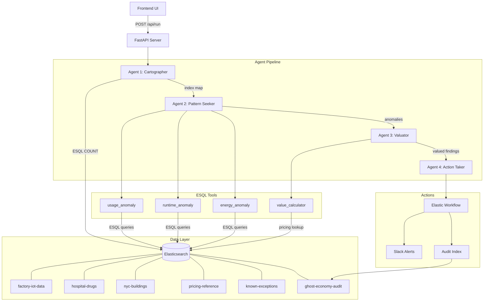

# Ghost Economy Hunter

**A 4-agent AI system built on Elastic Agent Builder that autonomously finds hidden financial waste inside any organization's Elasticsearch data.**

> Built for the [Elastic Agent Builder Hackathon 2026](https://elasticsearch.devpost.com)

---

## The Problem

Every organization leaks money through invisible inefficiencies buried in operational data:
- Hospitals over-order drugs that expire unused (US GAO estimates $765B/yr in healthcare waste)
- Factories run equipment during off-shifts burning $50K-200K/year per machine
- Commercial buildings consume full power at 8% occupancy (DOE: 30% of building energy is wasted)

These patterns hide in plain sight across Elasticsearch indexes. No one asks the right questions because **no one knows the questions exist**.

## The Solution

Ghost Economy Hunter doesn't wait for questions. It deploys 4 AI agents that autonomously scan, correlate, and value hidden waste across any number of Elasticsearch indexes -- zero configuration required.

---

## Architecture



### Agent Roles

| # | Agent | Role | Tools | Output |
|---|-------|------|-------|--------|
| 1 | **Cartographer** | Maps all indexes, identifies anomaly potential | Built-in ES introspection | Index map with domains and correlation pairs |
| 2 | **Pattern Seeker** | Runs 3 ES\|QL anomaly queries | `usage_anomaly`, `runtime_anomaly`, `energy_anomaly` | Typed anomalies with delta quantities |
| 3 | **Valuator** | Prices every anomaly using reference data | `value_calculator` | Dollar-valued findings with priority |
| 4 | **Action Taker** | Verifies, scores actionability, fires workflows | `trigger_action_workflow` | Slack alerts + audit records |

---

## Data Sources

| Index | Domain | Source | Records |
|-------|--------|--------|---------|
| `factory-iot-data` | Manufacturing IoT | Synthetic (realistic sensor patterns) | ~8,100 |
| `hospital-drugs` | Drug procurement | Synthetic + real CMS drug pricing | ~720 |
| `nyc-buildings` | Building energy | [NYC Open Data LL84](https://data.cityofnewyork.us/) + synthetic anomaly overlay | ~1,800 |
| `pricing-reference` | Unit costs | Real market rates (CMS ASP, EIA electricity) | 5 |
| `known-exceptions` | Approved exceptions | Sample exception records | 2 |
| `ghost-economy-audit` | Audit trail | Pipeline output | grows per run |

---

## Quick Start

### 1. Clone and install

```bash
git clone https://github.com/SahilRakhaiya05/Ghost-Economy-Hunter.git
cd Ghost-Economy-Hunter
python -m venv .venv
.venv\Scripts\activate      # Windows
# source .venv/bin/activate  # Mac/Linux
pip install -r requirements.txt
```

### 2. Configure credentials

```bash
cp .env.example .env
```

Fill in your Elasticsearch, Kibana, and Slack webhook URLs in `.env`.

### 3. Create indexes and generate data

```bash
python elastic/setup/create_indexes.py
python data/generate_all.py
```

### 4. Run the live demo

```bash
python api.py
```

Open [http://localhost:8000](http://localhost:8000) and click **Start Hunt** to run the real pipeline against live Elasticsearch data.

### 5. Run the pipeline directly (CLI)

```bash
python -m orchestrator.main
```

### 6. Run tests

```bash
pytest tests/ -v
```

---

## Project Structure

```
ghost-economy-hunter/
├── api.py                          # FastAPI server (frontend + /api/run)
├── constants.py                    # Index names, agent IDs
├── requirements.txt
├── .env.example
│
├── data/
│   ├── generate_all.py             # One-command data generation
│   ├── generate_factory.py         # Factory IoT sensor data
│   ├── generate_hospital.py        # Hospital drug procurement data
│   ├── fetch_nyc_buildings.py      # NYC building energy data (real + synthetic)
│   └── pricing_reference.json      # Unit cost reference (real market rates)
│
├── elastic/
│   ├── setup/
│   │   ├── create_indexes.py       # Creates 6 indexes with explicit mappings
│   │   └── index_data.py           # Bulk indexing pipeline
│   ├── tools/
│   │   ├── usage-anomaly.json      # ES|QL: drug over-procurement detection
│   │   ├── runtime-anomaly.json    # ES|QL: idle machine detection
│   │   ├── energy-anomaly.json     # ES|QL: building energy waste
│   │   └── value-calculator.json   # ES|QL: pricing reference lookup
│   ├── agents/
│   │   ├── cartographer.json       # Agent 1: index mapping
│   │   ├── pattern-seeker.json     # Agent 2: anomaly detection
│   │   ├── valuator.json           # Agent 3: dollar valuation
│   │   └── action-taker.json       # Agent 4: verification + workflow
│   └── workflows/
│       └── action_workflow.yaml    # Elastic Workflow: Slack + audit
│
├── orchestrator/
│   ├── main.py                     # 4-agent pipeline orchestrator
│   ├── elastic_client.py           # Elasticsearch client factory
│   ├── agent_caller.py             # Agent Builder API wrapper
│   └── value_formatter.py          # Currency formatting helpers
│
├── tests/
│   ├── test_value_formatter.py     # Unit tests for formatting
│   └── test_pipeline_logic.py      # Tests for scoring and priority
│
├── frontend/
│   └── index.html                  # Animated demo UI (live API + fallback)
│
└── dashboard/
    └── kibana_dashboard.json       # Kibana dashboard specification
```

---

## ES|QL Queries

All anomaly detection uses pure ES|QL. Example (drug over-procurement):

```sql
FROM hospital-drugs
| STATS
    total_ordered = SUM(qty_ordered),
    total_used    = SUM(qty_used)
  BY drug_name, wing_id
| EVAL
    delta       = total_ordered - total_used,
    waste_ratio = TO_DOUBLE(total_ordered - total_used) / TO_DOUBLE(total_ordered)
| WHERE waste_ratio > 0.25
| SORT waste_ratio DESC
| LIMIT 20
```

---

## API Endpoints

| Method | Path | Description |
|--------|------|-------------|
| `GET` | `/` | Serves the frontend |
| `POST` | `/api/run` | Runs the full 4-agent pipeline, returns JSON |
| `GET` | `/api/health` | Health check |

---

## What We Liked

1. **ES|QL tool system** -- Parameterized queries that agents call precisely. No prompt injection risk, deterministic results, testable in Kibana Dev Tools before deployment.
2. **Agent Builder's tool orchestration** -- Defining tools as ES|QL queries and assigning them to agents creates a clean separation between reasoning (agent) and execution (tool).

## Challenges

- Cross-correlating time-series data across indexes with different timestamp granularities (daily factory data vs per-order hospital data vs annual building data)
- ES|QL integer division silently truncates -- discovered that `10048 / 24891 = 0` in ES|QL and had to use `TO_DOUBLE()` casts

---

## Tech Stack

- **Python 3.11+** -- orchestration, data generation
- **elasticsearch-py 8.x** -- Elasticsearch client
- **ES|QL** -- all anomaly detection queries
- **Elastic Agent Builder** -- 4 agents + 4 tools in Kibana
- **Elastic Workflows** -- Slack alert + audit record automation
- **FastAPI + uvicorn** -- lightweight API server
- **NYC Open Data API** -- real building energy benchmarking data
- **pytest** -- test suite

---

## License

MIT -- see [LICENSE](LICENSE)
